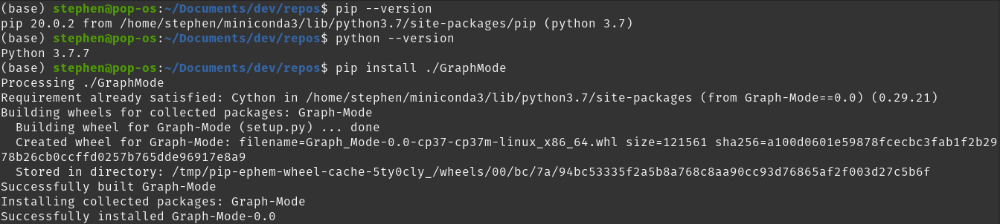
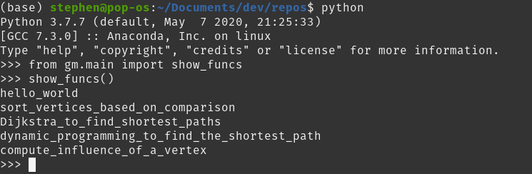
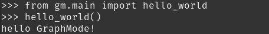
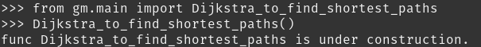

# A Cython software package that performs algorithms on a graph.  
## Installation  
`pip install ./GraphMode`  
#### This command would trigger setup.py to set up the software package and compile core functions into C codes.  
### Installation DEMO  
  
## Software DEMO  
### We provide a main interface to interact with the software package and core function.  
### Notes: most of the functions are under construction...  
#### 1, After the installation, head into Python console, and use the main interface to show all the available functions:  
  
#### 2, For a specific function, we can import it from the main interface, then invoke it:  
##### func demo 1 (`hello_world`):  
  
##### func demo 2 (`Dijkstra_to_find_shortest_paths`):  
  

