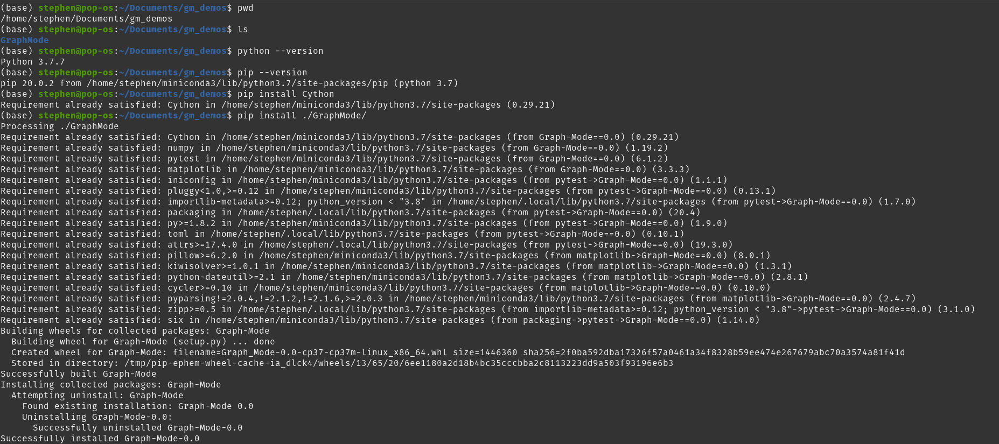

# A Python/Cython software library that performs algorithms on a graph.  

## Software running platform:  
### Linux

## Installation and Compilation  

### If you are a user:  
#### Dependency:
Python package-management system: `pip`  
   
#### Commands:  
`pip install Cython`  
This will install a Cython compiler for you :)  
`pip install ./GraphMode/`  
This command will do everything for ya!  
It will compile necessary Python codes into C codes and set up the software.  

you may see something like "ERROR: After October 2020 you may experience..."  Please ignore that.  

    

### If you are a developer (If you wanna hack codes or run the tests using pytest):    
#### Dependency:  
Anaconda or Miniconda  
   
#### Steps:    
1, Use Anaconda or Miniconda to generate an environment, we call the environment `graph_mode_conda_env` here.
    
2, Activate the conda environment just generated.  
    
3, make sure you are now at the root of the project:  
    
4, pip install all the dependencies in terms of `Cython`, `numpy`, `pytest` and `matplotlib`:  
`>>> pip install Cython`  
`>>> pip install numpy`  
`>>> pip install pytest`  
`>>> pip install matplotlib`  
and pip install this project itself to setup everything.  
`>>> pip install --editable .`  
You are good to go!  

### Test if the installation is successful (for both users and developers):  
#### Basically, if you can do the things below, you are legitimately good to go!  
   

## main objects introduction:  
### Vertex
implemented in: `./GraphMode/src/gm/main_objects/graph.py`  
An object having an ID (index) and a weight (impact) to define a vertex in a graph.  
usages:  
`>>> from gm.main_objects.graph import Vertex`  
`>>> vertex = Vertex(index=0, impact=10)`  
### Edge  
implemented in: `./GraphMode/src/gm/main_objects/graph.py`  
An object having two vertices as the ends and a cost to define an edge in a graph.  
usages:  
`>>> from gm.main_objects.graph import Vertex, Edge`  
`>>> edge = Edge(vertices=(0, 1), cost=3)`  
### Graph
implemented in: `./GraphMode/src/gm/main_objects/graph.py`  
An object having an array of vertices and an array of edges to define the graph.  
usages:  
`>>> from gm.main_objects.graph import Edge, Graph, Vertex`  
`>>> graph = Graph()`  
`>>> vertices = [Vertex(index=0, impact=10), Vertex(index=1, impact=8)]`  
`>>> edges = [Edge(vertices=(0, 1), cost=3)]`  
`>>> graph.vertices = vertices`  
`>>> graph.edges = edges`  

## Software DEMO  
#### Option 1: Test or assess algorithms by custom objects  
#### Detailed docstrings about explanations have been added in each implementation file.
let us first construct a graph using the objects mentioned above:  
   
#### minimum spanning tree + Dijkstra algorithm DEMO:  
  
it worked!  
the shortest distance from vertex 0 to vertex 0 is 0;  
the shortest distance from vertex 0 to vertex 1 is 2;  
the shortest distance from vertex 0 to vertex 2 is 5;  
the shortest distance from vertex 0 to vertex 3 is 4;  
#### comparison-based sorting algorithm DEMO:  
  
it worked!  
The impacts array had been successfully sorted.  
#### Floyd-Warshall Dynamic Programming DEMO:  
prepare essential input parameters related to the graph mentioned above:  
  
it worked!  
 

#### Option 2: If the above was overwhelming, we can also test or assess algorithms using prepared data sets.  
#### data sets can be found in `./GraphMode/tests/data` (5 data sets for each functionality)  
You just need:  
1, Activate the conda environment (`graph_mode_conda_env`);  
2, Import a function `test` from `gm.main`;  
3, Invoke func `test` with passing the path to the test txt file you interested. :)  
#### minimum spanning tree + Dijkstra algorithm DEMO:  
  
#### comparison-based sorting algorithm DEMO:  
  
#### Floyd-Warshall Dynamic Programming DEMO:  
  

## Pytest  
#### All the logic, instructions and explanations have been added in detailed docstrings in  `./GraphMode/tests`  
#### Feel free to inspect it to know what's going on :) 
### Testing  
1, first you need to install the project as a developer (instructions added above in section `Installation`);  
2, activate the conda environment:  
`conda activate graph_mode_conda_env`
3, head into the project:  
`>>> cd ./GraphMode/`  
4, execute Pytest:  
`>>> pytest tests`  
#### DEMO:  
   